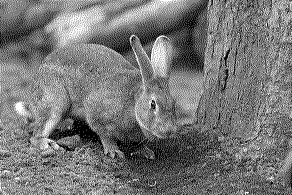
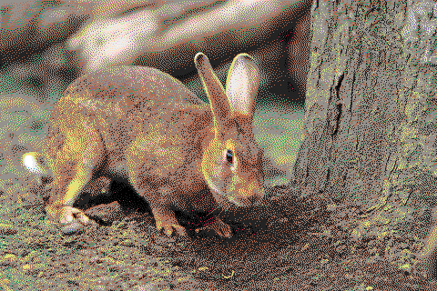

# Dither 1.3.2

Inspired by: <http://www.tannerhelland.com/4660/dithering-eleven-algorithms-source-code/>
- [crate](https://crates.io/crates/dither)
- [documentation](https://docs.rs/dither/1.3.1/dither/)
- [repository](https://gitlab.com/efronlicht/dither)

## License: MIT


## installation
```bash
cargo install dither
```

## CLI help:

```bash
dither --help
```

## usage

```bash
dither INPUT [OUTPUT] [-v] [--dither="floyd"] [--color="bw"] [--depth="1"] [--help]
```

## examples


    dither bunny.png burkes.png --dither=burkes



    dither bunny.png crayon.png --color=crayon



## args

### `INPUT`

the path to an input image. known good image formats are `.png` and `.jpg`.

### `OUTPUT`

the path to write the output. this will create or truncate the file at the existing location, if necessary. the image type will be inferred from the filename. currently, only `.png` and `.jpg` are supported.

### `-c`, `--color`

The color mode to use. Default is "bw" (black and white). Color mode to use.

#### "color"

(all colors with specified bit depth)

##### "bw"

black and white mode (grayscale in higher birt depths)

#### "crayon"

use the crayon color palette. see "crayon.plt" for details.

### "cga"

use the [cga](https://en.wikipedia.org/wiki/Color_Graphics_Adapter) color palette. see the wikipedia article or "cga.plt" for details.
#### $COLOR

single-color mode. options are

- BLUE
- GREEN
- CYAN
- RED
- MAGENTA
- BROWN
- LIGHT_GRAY
- GRAY
- LIGHT_BLUE
- LIGHT_GREEN
- LIGHT_CYAN "LIGHT_RED"
- LIGHT_MAGENTA
- YELLOW
- WHITE

#### $FILENAME

load a palette from file. palettes are specified as a list of two or more newline-separated 24-bit hexidecimals, with optional 0x prefix. see `crayon.plt` and `cga.plt` for examples.
```
// WHITE
0xffffff
// BLACK
0x000000
// RED
0xff0000
// GREEN
0x00ff00
// BLUE
0x0000ff
```
### `-d, --dither`

The type of ditherer to use. Available options are

- `"floyd"`, `"steinberg"`, `"floydsteinberg"` 
_(default, floyd-steinberg dithering)_

- `"atkinson"`,

- `"stucki"`,

- `"burkes"`,


- `"jarvis"`, `"judice"`, `ninke"` _Jarvis-Judice-Ninke dithering_
- `"sierra"`, `"sierra3"` _Sierra_ dithering

### `-v, --verbose`

Verbose debug output to stderr

### `--depth`

Default 1\. Bit depth should be an unsigned integer between 1 and 7\. The number of bits to compress each channel to. This option only works with the options `--color=$COLOR, --color=bw, --color=color`


## examples

